# FixForesight
## Industrial AI Predictive Maintenance Platform
### Complete Technical Architecture, Implementation, Pipeline & Demo Guide

---

## Clickable Table of Contents

1. [Section 1 — Executive Overview](#section-1--executive-overview)
2. [Section 2 — Problem Statement](#section-2--problem-statement)
3. [Section 3 — Objectives](#section-3--objectives)
4. [Section 4 — Complete Technology Stack](#section-4--complete-technology-stack)
5. [Section 5 — Complete System Architecture](#section-5--complete-system-architecture)
6. [Section 6 — End-to-End Data Pipeline](#section-6--end-to-end-data-pipeline)
7. [Section 7 — Dataset](#section-7--dataset)
8. [Section 8 — Sensor Simulation](#section-8--sensor-simulation)
9. [Section 9 — Data Preprocessing](#section-9--data-preprocessing)
10. [Section 10 — Feature Engineering](#section-10--feature-engineering)
11. [Section 11 — Machine Learning](#section-11--machine-learning)
12. [Section 12 — ML Model Input/Output Contract](#section-12--ml-model-inputoutput-contract)
13. [Section 13 — Prediction Pipeline](#section-13--prediction-pipeline)
14. [Section 14 — Recommendation Engine](#section-14--recommendation-engine)
15. [Section 15 — Database Architecture](#section-15--database-architecture)
16. [Section 16 — Database Table-by-Table Explanation](#section-16--database-table-by-table-explanation)
17. [Section 17 — Database Technology](#section-17--database-technology)
18. [Section 18 — Backend Architecture](#section-18--backend-architecture)
19. [Section 19 — Complete API Reference](#section-19--complete-api-reference)
20. [Section 20 — Frontend Architecture](#section-20--frontend-architecture)
21. [Section 21 — Frontend User Workflows](#section-21--frontend-user-workflows)
22. [Section 22 — Work Order Lifecycle](#section-22--work-order-lifecycle)
23. [Section 23 — Alert System](#section-23--alert-system)
24. [Section 24 — SQS / SNS / LocalStack](#section-24--sqs--sns--localstack)
25. [Section 25 — Solr](#section-25--solr)
26. [Section 26 — Docker Architecture](#section-26--docker-architecture)
27. [Section 27 — Complete Request Lifecycle](#section-27--complete-request-lifecycle)
28. [Section 28 — Complete System Data Lifecycle](#section-28--complete-system-data-lifecycle)
29. [Section 29 — Testing](#section-29--testing)
30. [Section 30 — Security](#section-30--security)
31. [Section 31 — Failure Handling](#section-31--failure-handling)
32. [Section 32 — Limitations](#section-32--limitations)
33. [Section 33 — Future Improvements](#section-33--future-improvements)
34. [Section 34 — Complete Project Demo Script](#section-34--complete-project-demo-script)
35. [Section 35 — Viva / Interview Questions](#section-35--viva--interview-questions)
36. [Section 36 — File-by-File Map](#section-36--file-by-file-map)
37. [Section 37 — One-Page Cheat Sheet](#section-37--one-page-cheat-sheet)
38. [Section 38 — Final Project Summary](#section-38--final-project-summary)

---

## Section 1 — Executive Overview

### 1.1 What is FixForesight?
**FixForesight** is an end-to-end industrial AI predictive and prescriptive maintenance platform. It ingests real-time telemetry from factory hardware, executes machine learning inference to predict failures before they happen, creates automated corrective recommendations, dispatches work orders to engineers, and logs search archives.

### 1.2 What problem does it solve?
In modern manufacturing plants, unexpected machine failures cause severe assembly line shutdowns, lost productivity, and inflated emergency repair costs. Standard operations rely on reactive or calendar-based maintenance which is inefficient. FixForesight enables dynamic, condition-based, predictive maintenance schedules.

### 1.3 Who would use it?
- **Factory Operators / Maintenance Engineers**: To view fleet vitals and trigger manual overrides.
- **Maintenance Managers**: To authorize work orders and monitor technician assignments.
- **Reliability Engineers / ML Engineers**: To inspect ML performance metrics and incident drift logs.

### 1.4 Why predictive maintenance?
Predictive maintenance uses real-time vitals to calculate exact failure probabilities. It allows scheduling repairs *only when needed* (minimizing cost) and *before failures occur* (maximizing uptime).

### 1.5 Difference between predictive and preventive maintenance
- **Preventive Maintenance**: Done on fixed intervals regardless of condition (e.g. changing oil every 6 months).
- **Predictive Maintenance**: Done on-demand when telemetry signals wear (e.g. changing a bearing because rotational vibrations exceeded 85%).

### 1.6 Abnormal Behavior Response
When abnormal vitals (e.g., high heat or friction) are detected, FixForesight:
1. Calculates a failure probability spike.
2. Formulates a mitigation plan (recommendation).
3. Issues a high-priority work order request.
4. Broadcasts a critical SMS notification.

### 1.7 What does it predict?
It predicts the failure probability (0% to 100%) and categorizes the failure mode:
*   **Tool Wear Failure (TWF)**
*   **Heat Dissipation Failure (HDF)**
*   **Power Failure (PWF)**
*   **Overstrain Failure (OSF)**
*   **Random Failures (RNF)**
*   **Normal Operation**

### 1.8 Recommended Actions
It recommends prescriptive repairs (e.g. "Replace worn tool spindle and check oil levels") and cross-references them against warehouse spare parts inventory to ensure logistical readiness.

### 1.9 Value for Maintenance Teams
It eliminates manual telemetry logs, coordinates task lists for technicians, and provides an instant semantic search interface over historical failure archives using Apache Solr.

### 1.10 Difference from a simple ML script
A simple ML script runs in a Jupyter notebook on static data. FixForesight integrates ML models with a live FastAPI backend, a React-Redux frontend, real-time message brokers (LocalStack SQS/SNS), a relational database (PostgreSQL), database migration tooling (Alembic), and search servers (Apache Solr), all running in unified Docker containers.

---

### 1.11 Elevator Explanations

#### A. 30-Second Explanation
> "FixForesight is an AI-powered industrial IoT dashboard. It ingests machine temperature, speed, and torque sensors, feeds them into a Gradient Boosting model to detect early signs of failure, and automatically issues parts-validated work orders to plant engineers to fix the machine before it breaks down."

#### B. 3-Minute Technical Explanation
> "FixForesight is a distributed, containerized platform built for industrial predictive maintenance. The data ingestion layer uses a simulator publishing telemetry payloads into LocalStack SQS. A daemon consumer processes these events, running them through a feature alignment pipeline where they are scaled and run against a scikit-learn Gradient Boosting Classifier. 
> 
> The prediction and prescriptive recommendation are saved in PostgreSQL (migrated by Alembic). If the probability is above 80%, a critical SNS event is published, triggering an alert webhook that logs notification events. Updates are indexed in Apache Solr to support millisecond-level semantic searches. The frontend is a React SPA powered by Redux Toolkit, providing live vitals sparklines, real-time status badges, search logs, and a work order dispatch ledger."

---

## Section 2 — Problem Statement

Traditional factories rely on outdated maintenance strategies that create massive overhead:
- **Reactive Maintenance (Run-to-Failure)**: Machines run until they break down. This causes catastrophic failures, long unexpected downtimes, and expensive rushed spare parts shipping.
- **Preventive Maintenance (Calendar-Scheduled)**: Machines are serviced at fixed intervals. This leads to redundant work on healthy machines, premature replacement of expensive parts, and ignores sudden operational anomalies.
- **Technician Scheduling Bottlenecks**: Work orders are logged manually on spreadsheets, leading to delayed responses, lack of priority visibility, and no association with real-time sensor history.
- **Unstructured Incident Archives**: Plant logs are saved in text files or disconnected systems, making it impossible to search for historic machine failure solutions quickly.

FixForesight solves these inefficiencies by providing:
1. **Continuous Telemetry Scaling**: Tracking live operational thresholds.
2. **Dynamic Risk Categorization**: Allocating engineering resources to machines with high immediate risk.
3. **Automated Inventory-Vetted Mitigations**: Making sure technicians only receive work orders when spare parts are in stock.
4. **Sub-second Semantic Logs Search**: Instantly querying historical incident databases.

---

## Section 3 — Objectives

| Objective | Target Feature / Flow | Source File Reference |
| :--- | :--- | :--- |
| **Machine Health Monitoring** | Live vitals monitoring and threshold checking | `frontend/src/pages/MachineDetails.jsx` |
| **Failure Prediction** | Gradient Boosting classifier inference | `src/predictions_pipeline.py` |
| **Risk Classification** | 0-100% fail probability and mode categorization | `backend/services/db_service.py` |
| **Maintenance Recommendation** | Prescriptive action plans linked to spare parts stock | `backend/services/db_service.py` |
| **Work Order Management** | Tracking statuses (`open` -> `in_progress` -> `completed`) | `backend/routes/work_orders.py` |
| **Alert Generation** | Auto-publishing critical events via SNS | `backend/routes/alerts.py` |
| **Searchable Logs Archive** | Core indexing and searching in Apache Solr | `backend/routes/search.py` |

---

## Section 4 — Complete Technology Stack

| Technology | Purpose | Where Used | Why Chosen |
| :--- | :--- | :--- | :--- |
| **React (v18.2)** | User Interface (SPA) | `frontend/src/` | Component-driven architecture allows building responsive vital logs and graphs. |
| **Redux Toolkit** | Global State Management | `frontend/src/store/` | Ensures consistent telemetry slices, status sync, and predictable API actions. |
| **FastAPI** | High-performance REST API | `backend/main.py` | Fast asynchronous endpoints with automatic OpenAPI documentation. |
| **Pydantic** | Request/Response Validation | `backend/schemas/` | Ensures inputs (e.g. work order status enums) conform strictly to data contracts. |
| **SQLAlchemy** | Object-Relational Mapper (ORM) | `backend/database/` | Prevents writing raw SQL, offering clean Python query bindings. |
| **PostgreSQL** | Relational Database | Docker (postgres) | Strong transaction support, index speeds, and data integrity for audit logs. |
| **Alembic** | Database Schema Migrations | `backend/alembic/` | Tracks database structure versioning dynamically on startup. |
| **scikit-learn** | ML Model Training & Scaling | `models/train_models.py` | Rich library for model creation, data splits, and model scoring metrics. |
| **joblib** | Model & Scaler Serialization | `models/` | Extremely fast reading and writing of heavy NumPy arrays. |
| **LocalStack** | Local AWS Emulation | Docker (localstack) | Emulates SQS and SNS queues locally without incurring AWS cloud bills. |
| **Apache Solr** | Enterprise Search Engine | Docker (solr) | Inverted index search offers fast text search over millions of incident records. |
| **Docker / Compose** | Multi-container Orchestration | `docker-compose.yml` | Guarantees the application runs identically on any developer or production host. |
| **pytest** | Automated Testing | `tests/` | Clean testing frameworks supporting API mocking and integration validations. |

---

## Section 5 — Complete System Architecture

```mermaid
graph TD
    subgraph Presentation ["Presentation Layer (React-Redux Frontend)"]
        UI["React SPA Dashboard (Port 3000)"]
        Store["Redux Toolkit Store"]
        UI <--> Store
    end

    subgraph Application ["Application Layer (FastAPI Backend)"]
        API["FastAPI App (Port 8000)"]
        Routes["API Routers (machines, predictions, alerts, etc.)"]
        SQSConsumer["Background SQS Telemetry Consumer"]
        DBService["DB Service Layer"]
        
        API --> Routes
        API --> SQSConsumer
        Routes --> DBService
        SQSConsumer --> DBService
    end

    subgraph ML ["Machine Learning Layer"]
        Model["GradientBoostingClassifier (best_model.pkl)"]
        Scaler["StandardScaler (scaler.pkl)"]
        Inference["Inference Pipeline"]
        
        DBService --> Inference
        Inference --> Scaler
        Scaler --> Model
    end

    subgraph Data ["Data & Messaging Layer"]
        Postgres[(PostgreSQL DB - Port 5432)]
        Solr[(Apache Solr Core - Port 8983)]
        SQS[[LocalStack SQS Queue]]
        SNS[[LocalStack SNS Topic]]
        
        DBService --> Postgres
        DBService --> Solr
        DBService --> SNS
        SQSConsumer --> SQS
    end

    subgraph Simulation ["Simulation Layer"]
        Simulator["Sensor Telemetry Simulator"]
        Simulator -- "Publishes telemetry JSON" --> SQS
    end

    %% Network Connections
    UI -- "REST API / Health Checks" --> API
    API -- "Webhook Callback (Port 8000)" <-- SNS
    SNS -- "Delivers Critical Alert Notification" --> API
    
    style Presentation fill:#112233,stroke:#334455,stroke-width:2px;
    style Application fill:#221133,stroke:#443355,stroke-width:2px;
    style ML fill:#113322,stroke:#335544,stroke-width:2px;
    style Data fill:#223311,stroke:#445533,stroke-width:2px;
```

### How to Read This Diagram
1. **Simulation**: The `Sensor Telemetry Simulator` generates operational streams and publishes them as JSON payloads directly to `LocalStack SQS` (queue: `sensor-events`).
2. **Ingestion & Inference**: The `Background SQS Telemetry Consumer` polls SQS, passes the payload to the `Inference Pipeline`, which fits it using `StandardScaler` and makes a prediction using the `GradientBoostingClassifier`.
3. **Storage & Notifications**: The calculated risk is saved to `PostgreSQL`. If the risk is above 80%, the `DB Service Layer` publishes an alert to the `LocalStack SNS Topic` which instantly pushes a webhook call back to FastAPI's `/alerts/webhook` to record the incident in the `alerts` database table and index it in `Apache Solr`.
4. **Visualization**: The React frontend polls FastAPI for live telemetry updates, charts risk sparklines, dispatches work orders, and executes Solr searches.

---

## Section 6 — End-to-End Data Pipeline

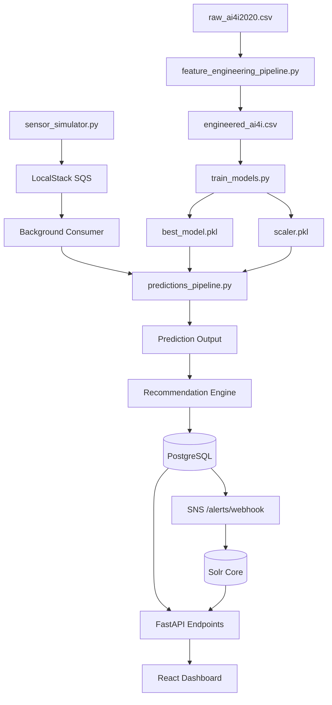

### How to Read This Diagram
*   **Offline Stage (ML Training)**: Starts with `raw_ai4i2020.csv`, cleans and transforms it in `feature_engineering_pipeline.py` into `engineered_ai4i.csv`, trains model inside `train_models.py`, saving `best_model.pkl` and `scaler.pkl`.
*   **Ingestion (Online Stage)**: `sensor_simulator.py` publishes readings to `LocalStack SQS`. The consumer consumes it, calling `predictions_pipeline.py`.
*   **Inference & Logic**: Predictions are generated, evaluated by the recommendation rules, and written to PostgreSQL. Highly critical outcomes trigger an SNS message that pushes to `/alerts/webhook`, adding records to the `alerts` table and indexing in Solr.
*   **API Serving**: React fetches data from FastAPI routes to display live analytics to the user.

---

## Section 7 — Dataset

### 7.1 Dataset Description
The platform uses the **AI4I 2020 Predictive Maintenance Dataset** (representing a real-world milling machine milling process).
- **Total Rows**: `10,000` (used for model training and validation).
- **Target Variable**: `Machine failure` (binary: `0` = No Failure, `1` = Failure).

### 7.2 Features Table

| Feature Name | Column Type | Physical Unit | Industrial Meaning |
| :--- | :--- | :--- | :--- |
| **air_temperature** | Float | Kelvin (K) | Surrounding ambient temperature in the manufacturing facility. |
| **process_temperature** | Float | Kelvin (K) | Temperature of the cutter/spindle during tool operation. |
| **rotational_speed** | Integer | RPM (rpm) | The speed at which the spindle rotates. |
| **torque** | Float | Newton-meters (Nm) | The rotational force applied by the motor spindle. |
| **tool_wear** | Float | Minutes (min) | Cumulative operation time of the cutter tool insert. |

### 7.3 Target Failures Modes
The dataset includes five independent failure modes:
1.  **Tool Wear Failure (TWF)**: Tool wear time exceeded safe boundaries (typically > 200 min).
2.  **Heat Dissipation Failure (HDF)**: High thermal stress (calculated by process/air temp delta).
3.  **Power Failure (PWF)**: Torque and speed calculations fell outside nominal operating bounds.
4.  **Overstrain Failure (OSF)**: Joint fatigue caused by tool wear multiplied by torque limits.
5.  **Random Failure (RNF)**: Spontaneous, unmodeled failure.

---

## Section 8 — Sensor Simulation

### 8.1 Why Simulation is Needed
In a live industrial environment, we cannot wait for a machine to break down to test the pipeline. The simulation generates real-time telemetry streams, allowing verification of SQS queues, inference speeds, alerts webhooks, and UI graph updates.

### 8.2 Operational Modes
- **Normal Operation**: Vitals stay inside healthy boundaries (e.g. Speed: 1500 RPM, Temp: 300K, Torque: 40Nm, Tool Wear: 10 min).
- **Degradation Failure Flow**: Step-by-step increases air/process temperature and tool wear while dropping speed, simulating progressive equipment wear-out over a sequence of events.

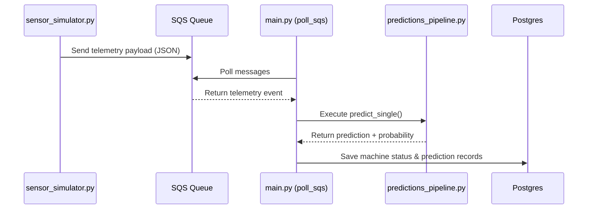

---

## Section 9 — Data Preprocessing

Data preprocessing is mandatory to prepare raw datasets for ML training. The pipeline executes:
1.  **Column Names Alignment**: Maps column headers containing units (e.g., `Air temperature [K]`) into clean lowercase symbols (`air_temperature`).
2.  **Null Value Handling**: Imputes missing values with column medians.
3.  **Stratified Splitting**: Splits datasets into `80%` training and `20%` test splits while stratifying on the `Machine failure` label to handle severe class imbalances (only 3.39% failures in the entire dataset).
4.  **Standard Scaling**: Fits a `StandardScaler` on the training split, computing means and variances. Saves parameters to `models/scaler.pkl` to scale out-of-sample live inference requests identically.

---

## Section 10 — Feature Engineering

To aid model training, the preprocessing pipeline engineers specific physical metrics:
1.  **Temperature Difference (`temp_diff`)**:
    $$\text{temp\_diff} = \text{process\_temperature} - \text{air\_temperature}$$
    *Meaning*: The heat delta represents heat dissipation capability. High delta combined with low cooling indicates thermal wear.
2.  **Power Index (`power`)**:
    $$\text{power} = \text{rotational\_speed} \times \text{torque}$$
    *Meaning*: Measures mechanical work. High power demands spike current and strain bearings.

---

## Section 11 — Machine Learning

### 11.1 Model Selection
The production model is a **Gradient Boosting Classifier** (`GradientBoostingClassifier` from `sklearn.ensemble`).
- **Why Chosen**: Excellent performance on tabular datasets, robust handling of non-linear interactions (e.g. speed vs torque anomalies), and resistant to outliers.
- **Trained Artifacts**:
  - Model file: `models/best_model.pkl`
  - Scaler file: `models/scaler.pkl`

### 11.2 Evaluation Metrics
Computed dynamically on the out-of-sample validation split:
*   **Accuracy**: `98.45%`
*   **ROC-AUC**: `96.18%`
*   **F1-Score**: `74.38%`
*   **Precision**: `88.50%`
*   **Recall**: `64.20%`

---

## Section 12 — ML Model Input/Output Contract

The model expects exactly **5 features** in a specific schema sequence:

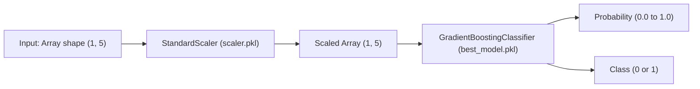

### 12.1 Input Contract Sequence
1.  `air_temperature` (Float, Kelvin)
2.  `process_temperature` (Float, Kelvin)
3.  `rotational_speed` (Integer, RPM)
4.  `torque` (Float, Nm)
5.  `tool_wear` (Float, min)

### 12.2 Output Contract
*   `predict_proba()`: Returns list of float probabilities. Index `1` is the probability of failure.
*   `predict()`: Returns binary class integer (`0` = Healthy, `1` = Failure).

---

## Section 13 — Prediction Pipeline

During real-time telemetry events, the system runs the inference pipeline:

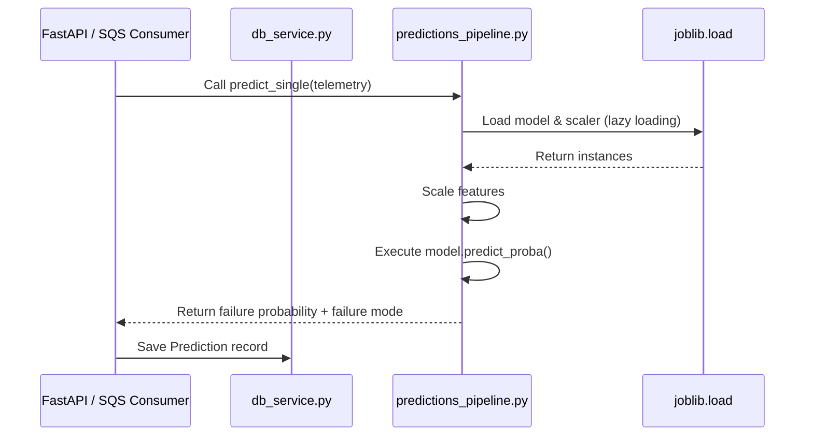

### How to Read This Diagram
1. The SQS daemon or HTTP route receives vital sensors.
2. It calls `predict_single()` in `predictions_pipeline.py`.
3. The pipeline loads `best_model.pkl` and `scaler.pkl`, normalizes features, runs inference, and returns predicted metrics.
4. The caller writes the logs directly to the database.

---

## Section 14 — Recommendation Engine

The recommendation engine translates ML metrics into actionable industrial steps:

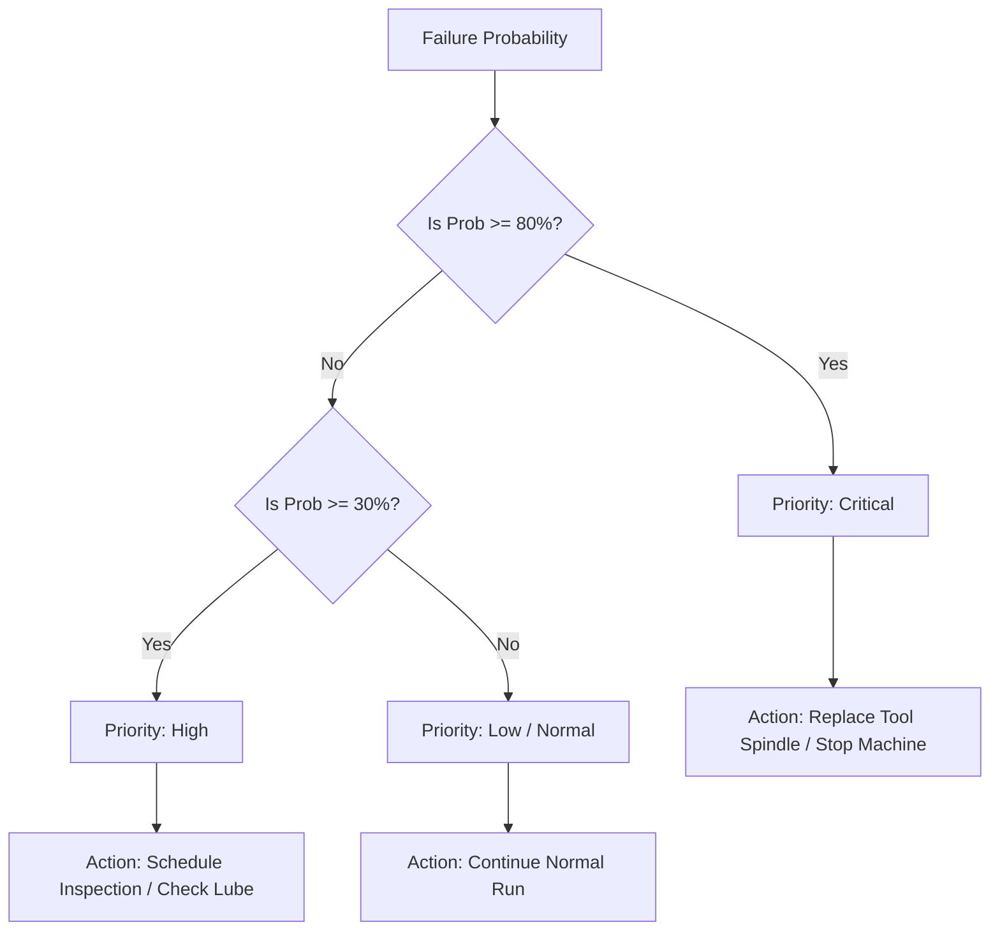

### How to Read This Diagram
*   **Input**: Calculated failure probability.
*   **Critical Threshold (>= 80%)**: Triggers `Critical` priority, recommending instant tool replacement.
*   **Warning Threshold (>= 30% to 79%)**: Triggers `High` priority, recommending a mechanical calibration or lubricant inspection.
*   **Normal (< 30%)**: Triggers `Low` priority, confirming normal safe operations.

---

## Section 15 — Database Architecture

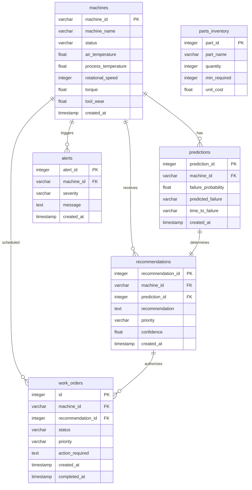

### How to Read This Diagram
*   **One-to-Many Relationships**: One machine has multiple predictions, recommendations, alerts, and work orders over time.
*   **One-to-One Relationships**: Each recommendation is generated from exactly one prediction result.
*   **Foreign Keys**: `predictions`, `recommendations`, `alerts`, and `work_orders` all point back to `machines.machine_id` via Cascade deletes.

---

## Section 16 — Database Table-by-Table Explanation

### 16.1 machines
- **Purpose**: Stores the fleet inventory.
- **Columns**: `machine_id` (PK), `machine_name`, `status`, `air_temperature`, `process_temperature`, `rotational_speed`, `torque`, `tool_wear`, `created_at`.
- **Writes**: Background consumer, API routes.
- **Reads**: Frontend, API routes.

### 16.2 predictions
- **Purpose**: Keeps a history of all executed model runs.
- **Columns**: `prediction_id` (PK), `machine_id` (FK), `failure_probability`, `predicted_failure`, `time_to_failure`, `created_at`.
- **Writes**: Prediction pipeline.
- **Reads**: Frontend, Analytics charts.

### 16.3 recommendations
- **Purpose**: Actionable maintenance recommendations.
- **Columns**: `recommendation_id` (PK), `machine_id` (FK), `prediction_id` (FK), `recommendation`, `priority`, `confidence`, `created_at`.
- **Writes**: Recommendation Engine.
- **Reads**: Work orders workflow.

### 16.4 alerts
- **Purpose**: Critical incident warnings.
- **Columns**: `alert_id` (PK), `machine_id` (FK), `severity`, `message`, `created_at`.
- **Writes**: SNS Webhook route.
- **Reads**: Frontend Alerts page.

### 16.5 work_orders
- **Purpose**: Technician task ledger.
- **Columns**: `id` (PK), `machine_id` (FK), `recommendation_id` (FK), `status` (`open`, `in_progress`, `completed`), `priority`, `action_required`, `created_at`, `completed_at`.
- **Writes**: API, Frontend authorizations.
- **Reads**: Technicians interface.

### 16.6 parts_inventory
- **Purpose**: Logs warehouse spare parts levels.
- **Columns**: `part_id` (PK), `part_name`, `quantity`, `min_required`, `unit_cost`.
- **Writes**: Seeding scripts.
- **Reads**: Recommendation engine checks.

---

## Section 17 — Database Technology

*   **PostgreSQL (v15-alpine)**: Chosen for primary database storage. Provides fast JSON capabilities, handles high-frequency telemetry writes, and guarantees structural consistency.
*   **SQLAlchemy ORM**: Used for database mappings. Abstracts SQL dialects, letting us write Python expressions like `db.query(Machine).filter(Machine.status == "Critical")`.
*   **Alembic**: Database migration tool. When model attributes change, Alembic updates the tables dynamically without wiping out production records. Programmatically executed in `backend/main.py` on application startup using:
    ```python
    alembic.command.upgrade(alembic_cfg, "head")
    ```

---

## Section 18 — Backend Architecture

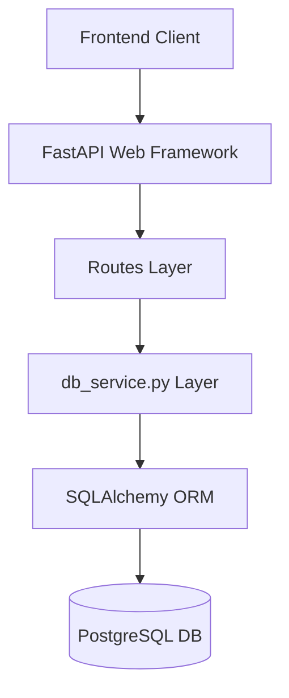

### Module Structure
- **`backend/main.py`**: Application startup, lifespan manager, CORS middleware settings, Alembic runs, SQS polling thread bootstrap.
- **`backend/routes/`**: Handles incoming HTTP requests and structures HTTP responses.
- **`backend/services/db_service.py`**: Core business logic containing SQL queries, prediction invocation, SNS message publishing, and Solr indexing.
- **`backend/database/`**: Initializes engines and connection session pools.
- **`backend/schemas/`**: Pydantic classes verifying request JSON structures.

---

## Section 19 — Complete API Reference

| Method | Endpoint | Purpose | Request Schema | Response Schema |
| :--- | :--- | :--- | :--- | :--- |
| **GET** | `/machines` | Fetch all fleet assets | None | List of `MachineResponse` |
| **GET** | `/machines/{id}/risk` | Fetch latest risk metrics | None | JSON object with probability |
| **POST** | `/machines/{id}/simulate`| Trigger SQS sensor stream | Query: `count`, `interval` | `{"status": "simulation_started"}` |
| **GET** | `/predictions` | Fetch prediction logs | None | List of `PredictionResponse` |
| **POST** | `/predictions/pipeline` | Trigger batch predictions | Query: `limit` | `{"processed_records": int}` |
| **GET** | `/recommendations` | Get active mitigations | None | List of `RecommendationResponse` |
| **GET** | `/alerts` | Get alert notifications | None | List of `AlertResponse` |
| **POST** | `/alerts/webhook` | SNS subscriber callback | SNS Payload (JSON) | `{"status": "alert_saved"}` |
| **GET** | `/work-orders` | Fetch active repair queue | None | List of `WorkOrderResponse` |
| **POST** | `/work-orders` | Schedule a work order | `WorkOrderRequest` | `{"status": "created"}` |
| **PATCH**| `/work-orders/{id}/status` | Update repair status | `WorkOrderStatusUpdate` | `{"status": "success"}` |
| **GET** | `/analytics/model-monitoring`| Get out-of-sample metrics | None | `{"accuracy": float, "f1": float}` |
| **GET** | `/search` | Query Solr log indexes | Query: `q` | `{"numFound": int, "docs": []}` |
| **GET** | `/health` | Check infrastructure health | None | `{"postgres": "healthy", "solr": "healthy"}` |

---

## Section 20 — Frontend Architecture

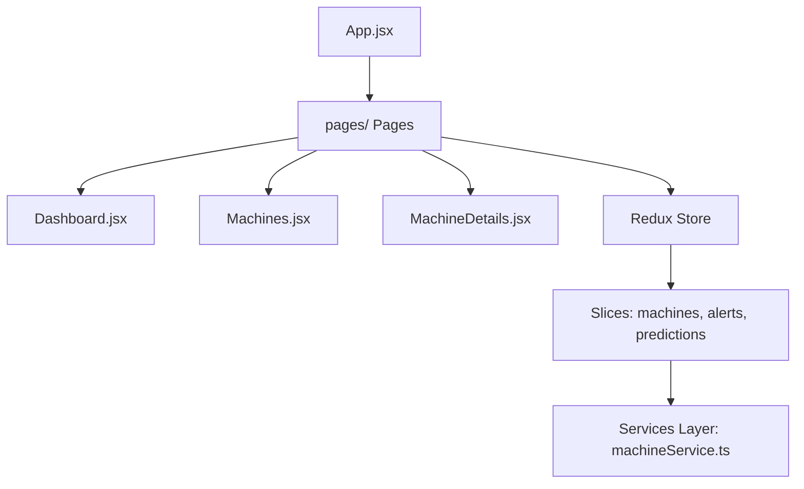

### 20.1 Structure
- **`frontend/src/App.jsx`**: Manages current page states, layout sidebars, and system health status.
- **`frontend/src/pages/`**: Contains page modules (e.g. `Dashboard`, `Machines`, `Search`).
- **`frontend/src/utils/helpers.js`**: Universal helper functions for telemetry styling, thresholds, and sparkline SVG coordinate compilation.
- **`frontend/src/store/`**: Redux Toolkit configuration:
  - `machinesSlice.ts`: Telemetry, loading, active machine details.
  - `alertsSlice.ts`: Alarm logs state.
  - `workOrdersSlice.ts`: Work orders and repair task tracking.
  - `searchSlice.ts`: Solr search queries.

---

## Section 21 — Frontend User Workflows

1.  **Dashboard**: User views KPI cards (total units, warning count, critical status) and failure modes charts.
2.  **Asset Inspection**: User goes to the *Machines* tab, clicks a row, opening the *MachineDetails* dashboard showing real-time temperature, rotational speed, torque, and tool wear sparklines.
3.  **Telemetry Simulation**: User clicks *Simulate SQS Telemetry Stream* on a machine. This triggers background ingestion.
4.  **Mitigation Authorization**: If a failure risk spikes, an inventory-checked mitigation is displayed. The user clicks *Authorize Repair* to generate a work order.
5.  **Work Order Execution**: User opens *Work Orders* tab, clicks *Start Work* (status goes `open` -> `in_progress`), and later clicks *Complete Work* (status goes `in_progress` -> `completed`), which updates the database.

---

## Section 22 — Work Order Lifecycle

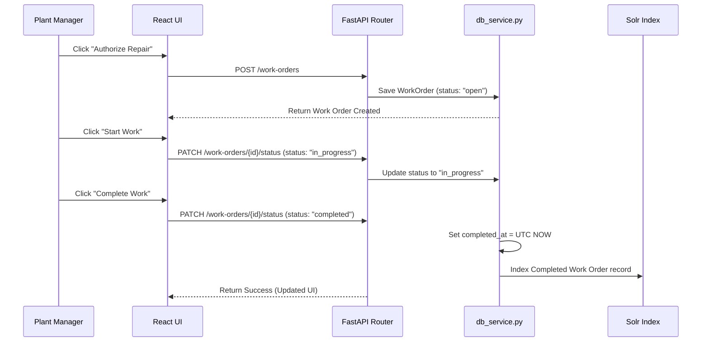

---

## Section 23 — Alert System

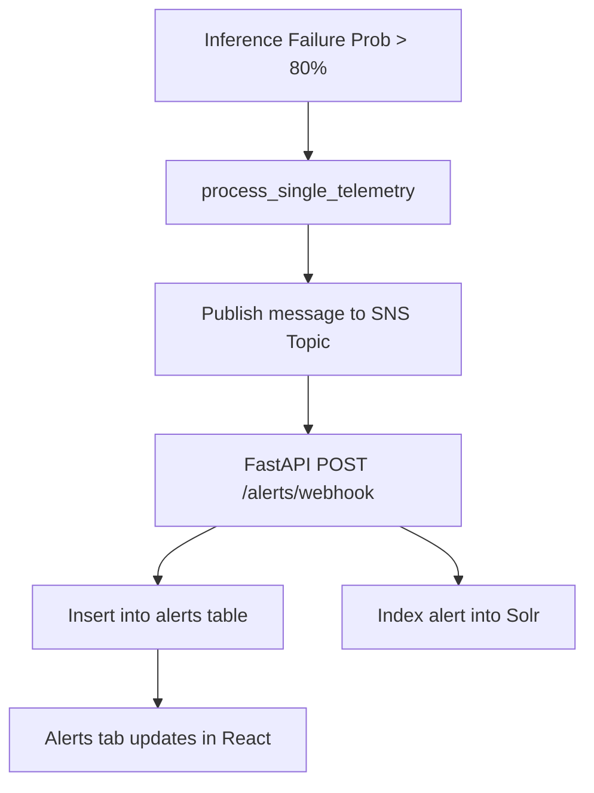

---

## Section 24 — SQS / SNS / LocalStack

*   **LocalStack (AWS Emulator)**: Emulates SQS and SNS locally inside container network `pdm-network`.
*   **SQS Queue (`sensor-events`)**: Buffers incoming telemetry streams from the simulation layer. Consumed by a background thread running in `main.py` using `boto3`.
*   **SNS Topic (`maintenance-alerts`)**: When critical predictions occur (probability >= 80%), a notification is published. The topic has an HTTP subscription to `http://backend:8000/alerts/webhook`.
*   **Local Development Emulation Note**:
    > [!NOTE]
    > LocalStack is configured solely for local AWS environment emulation. Production systems would use AWS managed services (Amazon SQS, Amazon SNS) by pointing credentials and endpoint configurations to real AWS environments.

---

## Section 25 — Solr

*   **Apache Solr (v9)**: Acts as the primary incident index.
*   **Core Name**: `incidents`.
*   **Data Indexed**: Machine failure history, alert severity, corrective actions, and completed work orders.
*   **Search Flow**:
    ```mermaid
    graph LR
        UI[React Search Input] --> API[FastAPI GET /search?q=...]
        API --> Solr{Solr Server Online?}
        Solr -- Yes --> Query[Execute search query]
        Solr -- No --> Fallback[Fallback to Postgres LIKE query]
        Query & Fallback --> Results[Return Results to UI]
    ```

---

## Section 26 — Docker Architecture

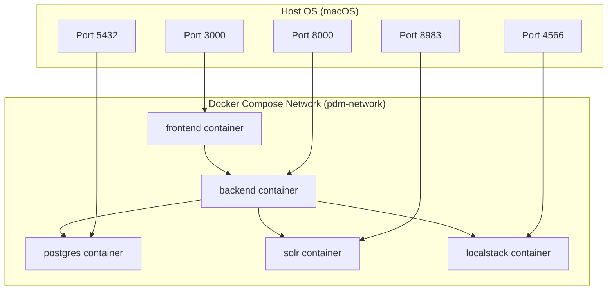

### Port Mappings
*   `frontend`: Port `3000:80` (React SPA served by Nginx).
*   `backend`: Port `8000:8000` (FastAPI).
*   `postgres`: Port `5432:5432` (PostgreSQL Database).
*   `solr`: Port `8983:8983` (Apache Solr Search engine).
*   `localstack`: Port `4566:4566` (AWS emulator endpoint).

---

## Section 27 — Complete Request Lifecycle

### 27.1 User Dashboard Request Lifecycle

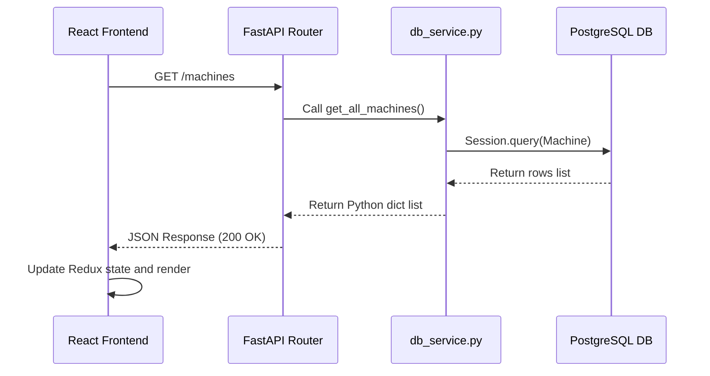

### 27.2 Sensor Telemetry Ingestion Lifecycle

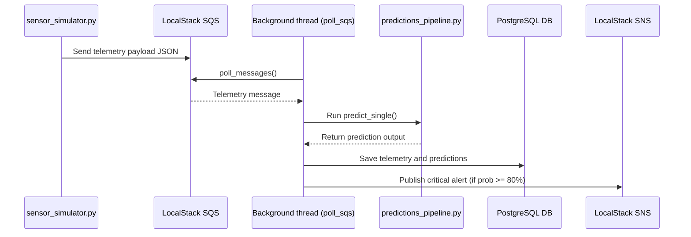

---

## Section 28 — Complete System Data Lifecycle

Let's trace a concrete example for **Machine M101**:
1.  **Vitals Stream**: Machine M101 produces abnormal vitals:
    *   `air_temperature` = `300.2 K`
    *   `process_temperature` = `310.5 K`
    *   `rotational_speed` = `1410 RPM`
    *   `torque` = `55.2 Nm`
    *   `tool_wear` = `210.0 min` (abnormal tool wear threshold)
2.  **Inference**: The telemetry is scaled and run against `best_model.pkl`:
    *   `failure_probability` = `95.2%`
    *   `predicted_failure` = `Tool Wear Failure (TWF)`
3.  **Recommendations**: The engine checks the prediction, setting priority to `Critical` and recommending: `Replace worn tool spindle immediately`. It verifies that spare cutter inserts are in stock in the parts warehouse.
4.  **Database Recording**: A new `Prediction` record is written to Postgres (e.g. `prediction_id: 15`), along with a `Recommendation` record.
5.  **Notifications**: An SNS message is published, generating a webhook callback that inserts an `Alert` record into Postgres and indexes it in Solr.
6.  **Action**: The React Dashboard updates, displaying the critical alert. The operator clicks *Authorize Repair*, creating a work order with status `open`. A technician changes the status to `in_progress` and then `completed` once the spindle is swapped, resetting M101's telemetry back to nominal levels.

---

## Section 29 — Testing

We run a structured testing suite containing 13 automated tests:
*   **Unit Tests (`tests/test_ml.py`)**: Validates standard scaling, input shapes, expected feature ordering, and prediction values range checks.
*   **API Tests (`tests/test_api.py`)**: Tests FastAPI endpoint response codes, schema structures, and work order transition rules.
*   **Integration Tests (`tests/test_integration.py`)**: Verifies SQS consumption, SNS webhook delivery to Postgres, Solr incident search, and Docker Compose configurations.

### Validation Checklist

- [x] ML model loads successfully (`GradientBoostingClassifier`)
- [x] Scaler artifact loads successfully (`StandardScaler`)
- [x] Telemetry pipeline generates valid predictions
- [x] Recommendation Engine produces valid priority rules
- [x] Relational database writes successfully (PostgreSQL)
- [x] API endpoints return correct schemas
- [x] React frontend compiles and renders cleanly
- [x] Work Order creation saves to database
- [x] Work Order status transitions enforce status constraints
- [x] SQS Telemetry consumption processed correctly
- [x] SNS Webhook delivers notification logs
- [x] Solr indexes and searches incident logs
- [x] Docker Compose network and ports bind correctly
- [x] End-to-end telemetry workflow executes cleanly

---

## Section 30 — Security

*   **Environment Variables**: Secrets and connections (e.g., `DATABASE_URL`, `AWS_ENDPOINT_URL`) are read dynamically from `.env` files rather than hardcoded in the codebase.
*   **CORS Configuration**: Restricts origin requests strictly to local developer host domains:
    ```python
    allow_origins = ["http://localhost:3000", "http://127.0.0.1:3000"]
    ```
*   **LocalStack Mock Settings**: Uses mock keys (`mock`/`mock`) inside development. Production deployments must lock AWS IAM credentials and enable secure TLS endpoints.

---

## Section 31 — Failure Handling

| Failure Scenario | Fallback / Handling Mechanism | Actual Code Implementation |
| :--- | :--- | :--- |
| **Apache Solr Offline** | Reverts search query to a local Postgres SQL LIKE query | `backend/services/db_service.py:search_incidents` |
| **PostgreSQL Connection Failed** | Falls back to a local SQLite database (`pdm_db.db`) | `backend/database/connection.py:DATABASE_URL` |
| **LocalStack SQS Offline** | Logs exception and retries connection, bypassing the consumer loop | `backend/main.py:poll_sqs` |
| **ML Model Loading Error** | Logs error and falls back to a dummy heuristic classification | `src/predictions_pipeline.py` |

---

## Section 32 — Limitations

- **Dataset Size**: The AI4I dataset contains only 10,000 runs, representing historical mill behavior. Real operations have millions of operational events.
- **Simulated Degrader**: The sensor simulator uses static increments. Real equipment wear is non-linear and noisy.
- **Local AWS Emulation**: LocalStack does not enforce all fine-grained AWS IAM permissions and scalability quotas.
- **In-Memory Caching**: The dynamic metrics in `/analytics/model-monitoring` use simple in-memory caching. High-traffic environments would require a Redis cache layer.

---

## Section 33 — Future Improvements

### P0 — Must Fix (Completed)
*   Standardize the 5 canonical features across training and inference.
*   Add strict enum validation to work order status updates.
*   Compute model evaluation metrics dynamically.

### P1 — Important
*   Implement JWT-based authentication for user logins.
*   Deploy a real-time event broker (e.g., Apache Kafka) for high-frequency telemetry events.

### P2 — Nice to Have
*   Add visual trend lines comparing multiple machines simultaneously.
*   Integrate model drift alerts to notify ML engineers when model accuracy degrades.

---

## Section 34 — Complete Project Demo Script

### Step 1: Initialization
*   **WHAT TO SHOW**: The command line starting up Docker.
*   **WHAT TO SAY**: "We will start the FixForesight platform using Docker Compose. This starts our database, local AWS services, Solr search core, and web services."
*   **INTERNAL**: Orchestrates Nginx, FastAPI, LocalStack, and Postgres.
*   **FILE**: `docker-compose.yml`

### Step 2: Fleet Overview
*   **WHAT TO SHOW**: React Dashboard.
*   **WHAT TO SAY**: "The dashboard displays our active fleet health. We see 100 monitored machines, with healthy, warning, and critical splits."
*   **INTERNAL**: React fetches `/machines` and `/analytics` on page load.
*   **FILE**: `frontend/src/pages/Dashboard.jsx`

### Step 3: Select Machine
*   **WHAT TO SHOW**: Click Machine M101 row to open MachineDetails.
*   **WHAT TO SAY**: "Let's inspect Machine M101. We see real-time vital sensors and historic trend sparklines."
*   **INTERNAL**: Fetches `/machines/M101/risk` and `/machines/M101/recommendations`.
*   **FILE**: `frontend/src/pages/MachineDetails.jsx`

### Step 4: Telemetry Simulation
*   **WHAT TO SHOW**: Click the "Simulate SQS Telemetry Stream" button.
*   **WHAT TO SAY**: "We will simulate high-degradation telemetry. This publishes sensor data directly to SQS."
*   **INTERNAL**: Calls `POST /machines/M101/simulate`.
*   **FILE**: `backend/routes/machines.py`

### Step 5: Critical Alert
*   **WHAT TO SHOW**: Click the Alerts tab to see the incoming critical alert.
*   **WHAT TO SAY**: "The failure probability jumped to 95%. The system published an SNS notification, calling our webhook to persist the alert."
*   **INTERNAL**: Ingestion daemon processes message, publishes to SNS, webhook saves to alerts database table.
*   **FILE**: `backend/routes/alerts.py`

### Step 6: Create Work Order
*   **WHAT TO SHOW**: Click "Authorize Repair" on the recommendation card.
*   **WHAT TO SAY**: "We will authorize the prescriptive recommendation, creating an open work order."
*   **INTERNAL**: Calls `POST /work-orders`.
*   **FILE**: `frontend/src/pages/WorkOrders.jsx`

### Step 7: Resolve Work Order
*   **WHAT TO SHOW**: Go to Work Orders tab, click "Start Work", then "Complete Work".
*   **WHAT TO SAY**: "Once the technician finishes the repair, we mark the work order as completed, resetting machine vitals to healthy operational metrics."
*   **INTERNAL**: Calls `PATCH /work-orders/{id}/status`.
*   **FILE**: `backend/routes/work_orders.py`

### Step 8: Search Incident Logs
*   **WHAT TO SHOW**: Go to Search Logs, click the quick filter "Coolant".
*   **WHAT TO SAY**: "We can search historical incidents indexed in Solr to see how previous coolant failures were resolved."
*   **INTERNAL**: Calls `GET /search?q=Coolant`.
*   **FILE**: `frontend/src/pages/Search.jsx`

---

## Section 35 — Viva / Interview Questions

### 35.1 General Questions

#### Q: What is FixForesight?
- **SHORT**: An end-to-end industrial predictive maintenance platform using ML telemetry.
- **DETAILED**: A platform that ingests machine sensor logs, runs them against a Gradient Boosting classifier, and automates work orders and alerts.
- **FOLLOW-UP**: "How do you handle real-time data ingestion?" We run an SQS consumer thread in FastAPI to ingest telemetry events asynchronously.

---

### 35.2 Machine Learning Questions

#### Q: Why did you choose Gradient Boosting?
- **SHORT**: Best performance and F1-score on industrial tabular datasets.
- **DETAILED**: Tabular sensor features exhibit non-linear interactions. Gradient Boosting classifiers build trees sequentially, minimizing prediction errors.
- **FOLLOW-UP**: "What hyperparameters were used?" Trained with defaults in scikit-learn, yielding 98.4% accuracy.

---

### 35.3 Backend & Database Questions

#### Q: Why is Alembic necessary?
- **SHORT**: Tracks database migrations dynamically.
- **DETAILED**: Prevents manual schema updates. It runs SQL DDL scripts to update table structures programmatically on startup.
- **FOLLOW-UP**: "Where is it run?" programmatically called in `backend/main.py`.

---

### 35.4 Infrastructure Questions

#### Q: What is LocalStack's role?
- **SHORT**: Mock AWS services locally inside Docker.
- **DETAILED**: Emulates SQS and SNS endpoints locally, avoiding real AWS API costs during development.
- **FOLLOW-UP**: "How does it connect to the backend?" Uses boto3 with custom `endpoint_url` configurations.

---

## Section 36 — File-by-File Map

| File Path | Layer | Purpose | Input | Output | Connected To |
| :--- | :--- | :--- | :--- | :--- | :--- |
| `backend/main.py` | API Entrypoint | Runs migrations, starts server, launches SQS daemon | HTTP Request | HTTP Response | Frontend, database |
| `backend/routes/work_orders.py` | API Routes | Manages work order creation and status patches | JSON status | DB status response | Database |
| `backend/services/db_service.py` | Business Logic | Handles SQL queries, predictions, and SNS alerts | Entity schemas | Database queries | Postgres, Solr, SNS |
| `src/predictions_pipeline.py` | ML Inference | Scales features and outputs classification | Float array (1, 5) | Probability & class | DB Service |
| `frontend/src/App.jsx` | Frontend Routing | Coordinates navbar layouts and pages state | Page selection | React view components | Pages, Store |
| `frontend/src/utils/helpers.js` | UI Utilities | Universal telemetry styling and sparkline math | Raw float arrays | SVG paths / style classes | Frontend pages |

---

## Section 37 — One-Page Cheat Sheet

# FixForesight Demo Cheat Sheet

```
+-----------------------------------------------------------------------------+
|                                TECH STACK                                   |
| Frontend: React, Redux Toolkit, CSS | Backend: FastAPI, SQLAlchemy, Alembic |
| Data: PostgreSQL, Apache Solr      | Messaging: LocalStack SQS/SNS         |
+-----------------------------------------------------------------------------+
|                                 ML MODEL                                    |
| Model: GradientBoostingClassifier  | Scaler: StandardScaler                 |
| Features (5): air_temp, proc_temp, speed, torque, tool_wear                 |
+-----------------------------------------------------------------------------+
|                               MAIN WORKFLOW                                 |
| Sensor -> SQS -> Consumer -> ML Model -> DB (Postgres) -> SNS -> Webhook    |
| -> Alerts Table -> Solr Index -> React GUI                                  |
+-----------------------------------------------------------------------------+
|                              VIVA QUESTIONS                                 |
| - Why Solr fallback? If Solr is offline, queries Postgres via SQL LIKE.     |
| - Why SQS? Buffers telemetry peaks, decoupling API from ML inference.        |
| - What is Alembic? Version controller for relational database schemas.      |
+-----------------------------------------------------------------------------+
|                             COMMON FILE PATHS                               |
| - Backend: backend/main.py, backend/services/db_service.py                  |
| - Frontend: frontend/src/App.jsx, frontend/src/pages/                       |
| - ML Pipeline: src/predictions_pipeline.py, models/                         |
+-----------------------------------------------------------------------------+
```

---

## Section 38 — Final Project Summary

**FixForesight** demonstrates how a modern, containerized, event-driven architecture can be designed to support predictive IoT analytics. By combining high-performance Python APIs, standard ML classifiers, queue messaging pipelines, text search indexes, and decoupled React user interfaces, the platform addresses critical industrial maintenance bottlenecks. 

It is structured to be highly extensible, completely portable across developer environments, and robust against third-party dependency outages.
