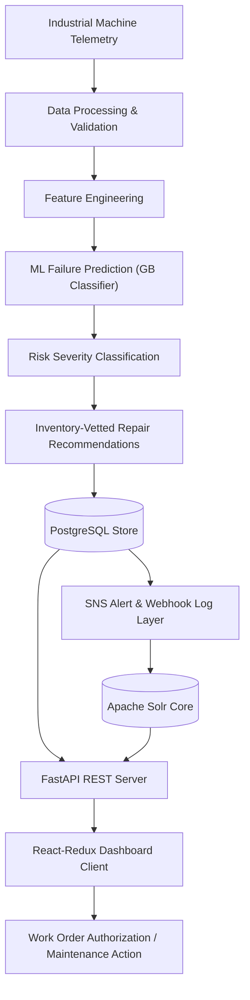
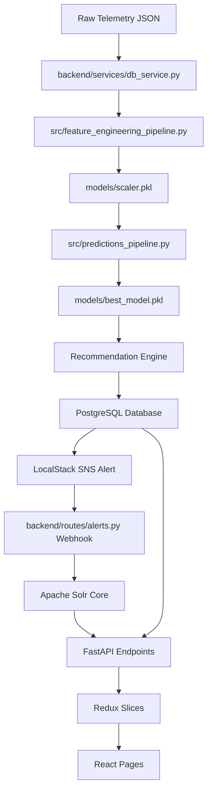
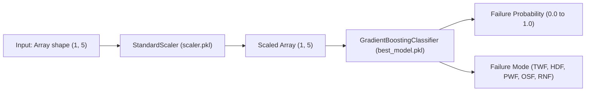
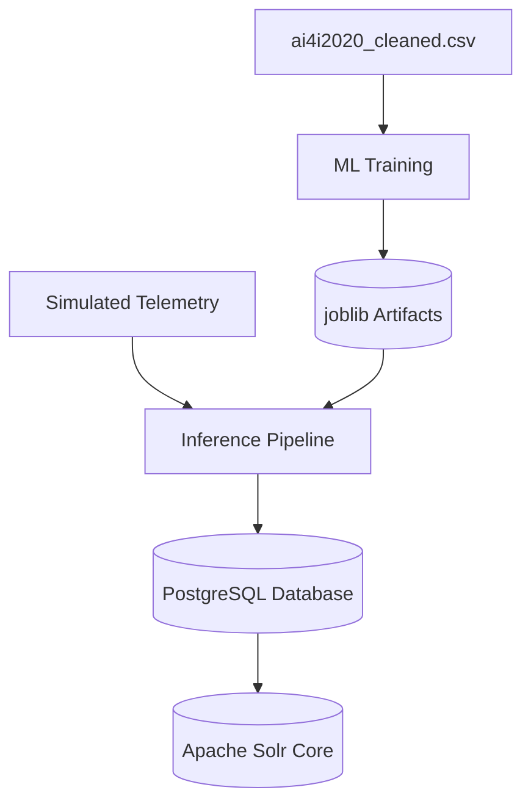
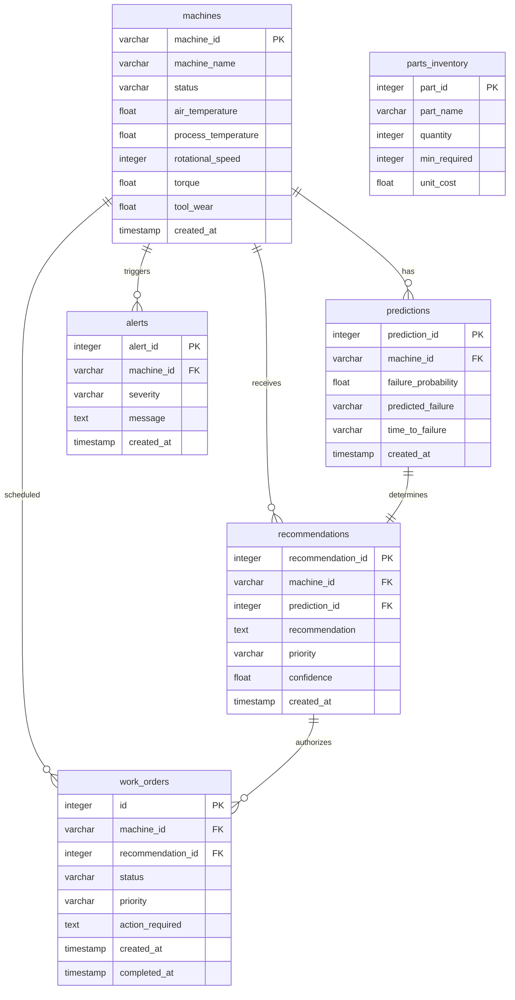
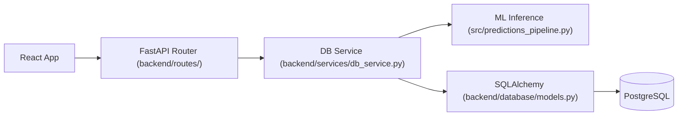
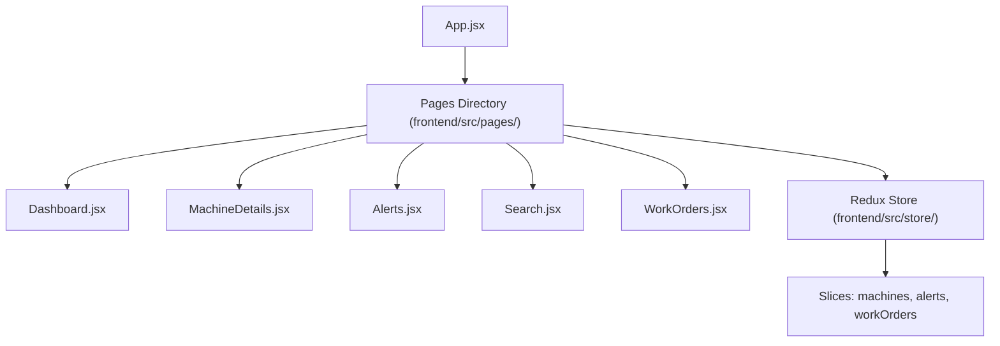
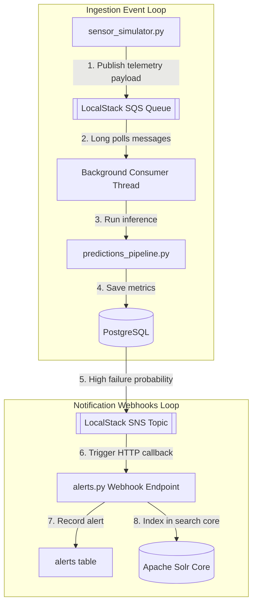
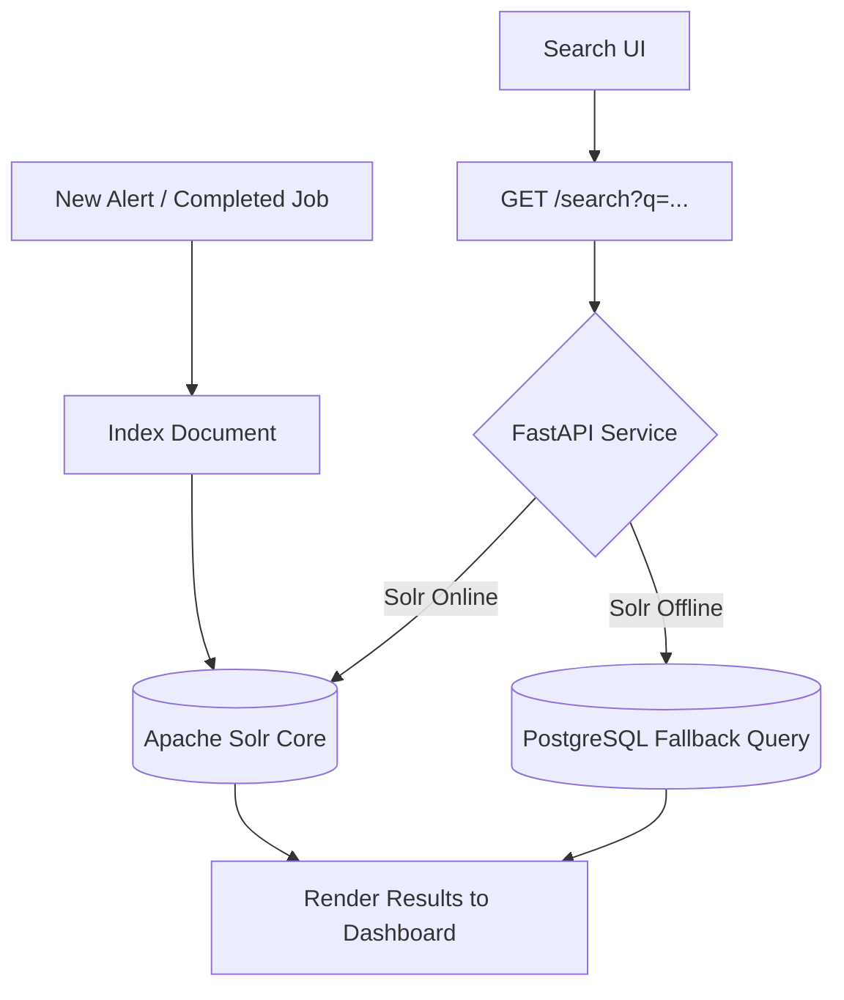

# FixForesight
## Industrial AI Predictive Maintenance Platform

FixForesight is an end-to-end, industrial AI predictive and prescriptive maintenance platform. It continuously ingests real-time sensor streams from factory machinery, executes machine learning inference to predict mechanical breakdowns before they occur, automatically constructs parts-validated prescriptive repair recommendations, alerts engineers via event-driven notifications, and maintains searchable historical incident logs.


---

## 1. Project Overview

FixForesight is a cloud-native decision-support platform designed for factory managers, maintenance engineers, and reliability specialists. The system automates the diagnostic loop of physical factory environments by integrating:
- **Telemetry Ingestion**: Streaming real-time sensor variables.
- **Dynamic Feature Engineering**: Constructing physical stress indicators.
- **Machine Learning Inference**: Forecasting failure probabilities and operational modes.
- **Prescriptive Analytics**: Matching repair recommendations with inventory levels.
- **Event-Driven Workflows**: Publishing critical alerts and orchestrating technician task ledgers.
- **Incident Archive Indexing**: Enabling rapid semantic searches over previous mechanical incidents.

All components run inside unified Docker containers, providing a production-grade demonstration of decoupled frontend, backend API, machine learning, messaging, and search layers.

---

## 2. Problem It Solves

Traditional manufacturing environments suffer from massive financial overheads due to outdated maintenance models:
- **Reactive Maintenance (Run-to-Failure)**: Machinery is only serviced after a breakdown. This causes sudden line shutdowns, lost productivity, expensive emergency shipping for replacement parts, and hazardous working conditions.
- **Preventive Maintenance (Calendar-Scheduled)**: Machinery is serviced at fixed intervals regardless of condition. This results in redundant labor costs, unnecessary spare parts wear, and fails to catch sudden operational spikes.
- **Operational Silos**: Vitals logs are stored in static spreadsheets or raw texts, making historical diagnostic logs impossible to query during active machine alerts.

FixForesight replaces these models with a **Condition-Based Predictive Maintenance** approach. It continuously monitors equipment anomalies, computes imminent failure risks, prescribes repairs, and logs outcomes into searchable archives.

---

## 3. Solution Overview



---

## 4. End-to-End System Pipeline



### Ingestion & Data Preparation
Raw sensor telemetry is generated and sent via REST or SQS event payload. The endpoint receives it and passes the measurements to the feature engineering pipeline ([feature_engineering_pipeline.py](src/feature_engineering_pipeline.py)), which parses the fields, formats units, and calculates engineered columns.

### Machine Learning Inference
The processed arrays are passed to the inference script ([predictions_pipeline.py](src/predictions_pipeline.py)), which loads the serialized standard scaler (`scaler.pkl`) and Gradient Boosting model (`best_model.pkl`). The script outputs a continuous failure probability and categorizes the machine failure mode.

### Action Plans & Notifications
The database service writes the results to PostgreSQL. If the failure probability is at or above 80%, the database service publishes a notification to the LocalStack SNS topic. The SNS topic calls an HTTP webhook ([alerts.py](backend/routes/alerts.py)), which creates an alert record in the database and indexes the event in the Solr search engine core.

### Dashboard Operations
The React application fetches data from FastAPI routes ([main.py](backend/main.py)), updating the Redux state cache to display status changes. The user can authorize recommendations, dispatch work orders, and search previous logs.

---

## 5. System Architecture

```mermaid
graph TD
    subgraph Presentation ["Presentation Layer"]
        ReactUI["React Single Page Application"]
        ReduxStore["Redux Toolkit Global Store"]
        ReactUI <--> ReduxStore
    end

    subgraph Application ["API & Application Layer"]
        FastAPI["FastAPI Web Framework"]
        Routers["APIs Routers (machines, predictions, search, work orders)"]
        Consumer["Background SQS Telemetry Consumer"]
        DBService["DB Service Layer (db_service.py)"]
        
        FastAPI --> Routers
        FastAPI --> Consumer
        Routers --> DBService
        Consumer --> DBService
    end

    subgraph Intelligence ["Intelligence Layer (ML & Decisions)"]
        PredictPipeline["Inference Pipeline (predictions_pipeline.py)"]
        GBModel["GradientBoostingClassifier (best_model.pkl)"]
        Scaler["StandardScaler (scaler.pkl)"]
        RecEngine["Recommendation Rules Engine"]
        
        DBService --> PredictPipeline
        PredictPipeline --> Scaler
        Scaler --> GBModel
        DBService --> RecEngine
    end

    subgraph Data ["Data & Messaging Infrastructure"]
        PostgreSQL[(PostgreSQL DB - Port 5432)]
        Solr[(Apache Solr Core - Port 8983)]
        LocalStackSQS[[LocalStack SQS Queue]]
        LocalStackSNS[[LocalStack SNS Topic]]
        
        DBService --> PostgreSQL
        DBService --> Solr
        DBService --> LocalStackSNS
        Consumer --> LocalStackSQS
    end

    ReactUI -- "REST HTTP Calls (Port 8000)" --> FastAPI
    LocalStackSNS -- "HTTP Webhook Event Delivery" --> FastAPI
    
    style Presentation fill:#112233,stroke:#334455,stroke-width:2px;
    style Application fill:#221133,stroke:#443355,stroke-width:2px;
    style Intelligence fill:#113322,stroke:#335544,stroke-width:2px;
    style Data fill:#223311,stroke:#445533,stroke-width:2px;
```



---

## 6. How Components Connect

| Component | Connects To | Communication | Purpose |
| :--- | :--- | :--- | :--- |
| **React UI** | **FastAPI** | REST API HTTP calls | Fetches fleet telemetry, posts work orders, and runs log searches. |
| **FastAPI** | **PostgreSQL** | SQLAlchemy Session | Persists machine vitals, predictions, alerts, and work order records. |
| **FastAPI** | **Apache Solr** | HTTP Solr Queries | Indexes new incidents and fetches log search results. |
| **FastAPI** | **LocalStack SQS** | boto3 SQS Polling | Polls SQS queues for simulated machine telemetry events. |
| **DB Service** | **ML Inference** | Function execution | Passes telemetry variables to normalise, scale, and run predictions. |
| **DB Service** | **LocalStack SNS** | boto3 SNS Publish | Publishes critical alerts (probability >= 80%) to SNS topics. |
| **LocalStack SNS**| **FastAPI Webhook**| HTTP Webhook Callback | Pushes SNS alerts back to FastAPI to write alert logs to PostgreSQL and Solr. |

---

## 7. Technology Stack

### Frontend
*   **React (v18.2)**: Single Page Application framework managing the telemetry interface.
*   **Redux Toolkit**: Centralized store handling loading states, telemetry, and work orders.
*   **Vanilla CSS**: Sleek glassmorphic design and responsive grids.

### Backend
*   **FastAPI**: Python web framework for asynchronous routing and API validation.
*   **Uvicorn**: ASGI web server handling HTTP requests.
*   **Pydantic**: Contract validation layer ensuring inputs (e.g. work order status enums) are valid.

### Machine Learning & Data Science
*   **scikit-learn**: Python framework for feature scaling and Gradient Boosting model training.
*   **joblib**: High-performance serialization utility caching trained models and scalers.
*   **Pandas & NumPy**: Tabular data manipulation and array processing.

### Database
*   **PostgreSQL 15**: Relational database storing machine telemetry, work orders, and alerts.
*   **SQLAlchemy ORM**: Object-relational mapping layer.
*   **Alembic**: Database migrations framework programmatically executed on application startup.

### Messaging & Event Architecture
*   **LocalStack (AWS Emulator)**: Mock AWS ecosystem running SQS and SNS locally.
*   **Amazon SQS**: Ingestion queue buffering incoming telemetry events.
*   **Amazon SNS**: Broadcast topic delivering webhook calls for critical alerts.

### Search
*   **Apache Solr 9**: Full-text indexing core providing log searches over historical failure logs.

---

## 8. Why These Technologies?

| Technology | Why FixForesight Uses It |
| :--- | :--- |
| **React** | Component reuse enables separated pages (Dashboard, Machines, Alerts, Search, Work Orders). |
| **FastAPI** | Asynchronous execution allows background SQS polling and API requests without blocking. |
| **PostgreSQL** | Maintains relational constraints and indexes foreign keys across predictions and work orders. |
| **SQLAlchemy** | Simplifies queries and automatically falls back to local SQLite if Postgres is unavailable. |
| **scikit-learn** | Out-of-the-box support for Gradient Boosting models, scalers, and training splits. |
| **LocalStack** | Simulates SQS/SNS locally, avoiding cloud provider costs during development. |
| **Apache Solr** | Offers fast text search queries over incident logs, bypassing slower database queries. |
| **Docker** | Guarantees all services (Postgres, Solr, LocalStack, FastAPI, React) spin up correctly. |

---

## 9. Machine Learning

The ML component is trained on historical data to predict machine breakdowns:
- **Dataset**: AI4I 2020 Predictive Maintenance Dataset (10,000 runs, ~3.4% failure rate).
- **Canonical Model Features**: air_temperature, process_temperature, rotational_speed, torque, tool_wear.
- **Model Selected**: `GradientBoostingClassifier` (scikit-learn), saving binary predictions and continuous probabilities.
- **Feature Scaling**: `StandardScaler`, ensuring variables (like speed in RPM vs torque in Nm) are scaled.
- **Saved Artifacts**: Model is cached in `models/best_model.pkl` and the scaler parameters in `models/scaler.pkl`.



---

## 10. Data Architecture

Data is processed through training, ingestion, and persistence stages:
1.  **Training**: Raw datasets are cleaned, engineered columns are constructed, and features are scaled before training.
2.  **Telemetry Stream**: Real-time sensor payloads are processed through the same scaling parameters.
3.  **Inference Persistence**: Model predictions and recommendations are saved to PostgreSQL.
4.  **Incident Archive**: Critical incidents and resolved work orders are indexed into the Solr search engine.



---

## 11. Database Architecture



### Table Relationships
*   **Machine Associations**: One machine has multiple predictions, recommendations, alerts, and work orders over time.
*   **Inference Links**: Each recommendation is linked back to a specific prediction.
*   **Cascade Deletes**: Deleting a machine record cleans up all downstream predictions, alerts, and work orders.

---

## 12. Database Schema Overview

| Table | Purpose | Key Relationships |
| :--- | :--- | :--- |
| **`machines`** | Stores the physical assets directory. | Primary key referenced by predictions, work orders, and alerts. |
| **`predictions`** | Keeps history of ML model predictions. | Foreign key to `machines`. |
| **`recommendations`** | Actionable prescriptive maintenance steps. | Foreign keys to `machines` and `predictions`. |
| **`alerts`** | Critical system alerts. | Foreign key to `machines`. |
| **`work_orders`** | Maintenance technician task records. | Foreign keys to `machines` and `recommendations`. |
| **`parts_inventory`**| Logs warehouse parts levels. | Referenced by the recommendation engine. |

---

## 13. API / Application Architecture

The backend exposes REST APIs using FastAPI routers, delegating queries to the database service layer:



*Detailed API routes and schema contracts are documented in the master project documentation.*

---

## 14. Frontend Architecture

The frontend is a decoupled React single page application. It polls the FastAPI server and caches telemetry records inside Redux state slices:



---

## 15. Event-Driven Components

FixForesight uses an event-driven flow to buffer telemetry events and broadcast critical alarms asynchronously:



*LocalStack is configured solely for local AWS environment emulation. Production systems would use AWS managed services (Amazon SQS, Amazon SNS) by pointing credentials and endpoint configurations to real AWS environments.*

---

## 16. Search Architecture

Search indices are handled by Apache Solr to avoid query load on PostgreSQL:



---

## 17. Repository Structure

```
FixForesight/
├── backend/                ← FastAPI application
│   ├── routes/             ← API endpoint definitions
│   ├── services/           ← Service layers & SQS consumers
│   ├── database/           ← Connection configurations & SQLAlchemy models
│   ├── schemas/            ← Pydantic contract validation
│   └── alembic/            ← Database migration files
├── frontend/               ← React Single Page Application (SPA)
│   ├── src/
│   │   ├── pages/          ← Dashboard views
│   │   ├── store/          ← Redux Toolkit slices
│   │   ├── services/       ← API service handlers
│   │   ├── utils/          ← Telemetry chart formatting helpers
│   │   └── App.jsx         ← Main layout shell
│   └── Dockerfile          ← Nginx container configuration
├── models/                 ← Cached model & scaler parameters (.pkl)
├── src/                    ← Data engineering & training files
├── data/                   ← Training datasets (.csv)
├── infra/                  ← AWS LocalStack shell initializers
└── tests/                  ← Pytest automated suites (ML unit, API, integration)
```

| Directory | Responsibility |
| :--- | :--- |
| **`backend/`** | Implements the web API endpoints, database structures, and background event listeners. |
| **`frontend/`** | Decoupled UI modules, state controllers, and telemetry visualization dashboards. |
| **`models/`** | Caches the standard scaler and Gradient Boosting classifier model binaries. |
| **`src/`** | Features preprocessing, model training scripts, and telemetry simulation methods. |
| **`tests/`** | Holds all unit, mock API, and service integration tests. |

---

## 18. Documentation

For setup instructions, deployment steps, code definitions, and demo commands, reference the project's documentation:

| Document | Purpose |
| :--- | :--- |
| **[Master Technical Documentation](./Document.md)** | **Complete technical guide containing file-by-file explanations, API reference details, testing matrix results, and a step-by-step 15-minute demo script.** |
| **System Architecture** | Technical layout decisions, layers, and service connection maps. |
| **Database Design** | Entity-Relationship layouts, column dictionary, and schemas. |
| **Data Engineering** | Datasets, preprocessors, and feature engineering details. |
| **Machine Learning** | Model evaluation metrics, training variables, and feature contracts. |
| **Backend Reference** | API parameters, routes, and JSON schema examples. |
| **Testing Strategy** | Pytest suites coverage and mock verification checklists. |
| **Infrastructure Setup** | LocalStack configurations and DockerCompose structures. |

---

## 19. Project Architecture at a Glance

```
       +-----------------------+
       |   React-Redux UI      |
       +-----------+-----------+
                   | (REST / Port 3000)
                   v
       +-----------------------+
       |   FastAPI Web API     |
       +-----------+-----------+
                   | (SQLAlchemy / Port 8000)
                   v
       +-----------------------+
       |   PostgreSQL DB       |
       +-----------+-----------+
                   | (Port 5432)
                   v
  +---------------------------------+
  |        ML Inference (GB)        |
  | air_temp | proc_temp | speed    |
  | torque   | tool_wear            |
  +---------------------------------+
                   | (Port 4566)
                   v
  +---------------------------------+
  | LocalStack AWS: SQS Telemetry   |
  | & SNS Webhook Alerts            |
  +---------------------------------+
                   | (Port 8983)
                   v
  +---------------------------------+
  |  Apache Solr: Incident Search   |
  +---------------------------------+
```

---

## 20. Engineering Characteristics

- **Service Decoupling**: Separation of presentation, application, intelligence, and data layers.
- **Persistent Telemetry**: Standard database persistence for sensor measurements and predictions.
- **Failover Search Integration**: Search queries automatically fall back to Postgres LIKE queries if Apache Solr is offline.
- **Schema Control**: Alembic tracks and migrates database schemas programmatically on application startup.
- **Docker Compose Binds**: Unified networks and volume containers make deployment quick and portable.

---

## 21. Design Principles

- **Separation of Concerns**: React handles state rendering, FastAPI parses endpoint routing, scikit-learn models compute ML classifications, and Postgres handles transaction processing.
- **Modularity**: Individual routers are created for each entity (e.g. `machines.py`, `work_orders.py`), and pages are split into separate components (`Dashboard.jsx`, `Alerts.jsx`).
- **Robust Abstraction**: Database queries are written through SQLAlchemy, allowing developers to query entities without writing raw SQL.

---

## 22. Project Value

- **Uptime Optimization**: Predicts mechanical failures before they happen, allowing plant engineers to intervene early.
- **Logistical Readiness**: Matches mitigations to live spare parts stock to ensure required tools are in warehouse inventory.
- **Workflow Coordination**: Connects ML alarms to automated work orders, providing maintenance teams with prioritized task schedules.
- **Incident History**: Logs incident outcomes, allowing engineers to query previous diagnostic resolutions.

---

## 23. Architectural Diagram Index

| Diagram | What It Explains |
| :--- | :--- |
| **1. System Architecture** | High-level data paths between client, API, database, and message brokers. |
| **2. End-to-End Pipeline** | The processing lifecycle from raw telemetry JSON to ML, databases, and UI. |
| **3. ML Pipeline** | The standard scaling, model classification, and risk outputs. |
| **4. Database Schema** | Entity-relationship diagrams detailing tables, foreign keys, and cardinalities. |
| **5. Frontend Components** | React page routing and Redux state cache configurations. |
| **6. Event-Driven Flows** | Telemetry ingestion via SQS queues and alert broadcasting via SNS webhooks. |
| **7. Search Flows** | Search index queries and the database fallback execution logic. |
| **8. Port Binds Map** | Unified container layouts and mapped ports configurations. |

---

## 24. Detailed Documentation Link

To view the complete engineering handbook, installation guides, API schemas, testing matrices, and presenting scripts, read the **[FixForesight Master Documentation](./Document.md)**.

The master technical guide contains:
*   File-by-file codebase responsibilities mapping.
*   Pydantic JSON requests and response specifications.
*   Pytest automated test configurations and coverage results.
*   Docker Compose service variables and volume mappings.
*   **Step-by-step 15-minute live project presentation script.**
*   **Technical Viva / Interview preparation question bank.**

---

## 25. Project Summary

FixForesight is an industrial AI predictive maintenance platform that integrates machine telemetry, feature scaling, Gradient Boosting classifiers, risk classifications, prescriptive repair recommendations, persistent SQL databases, and search servers into a single maintenance workflow.
