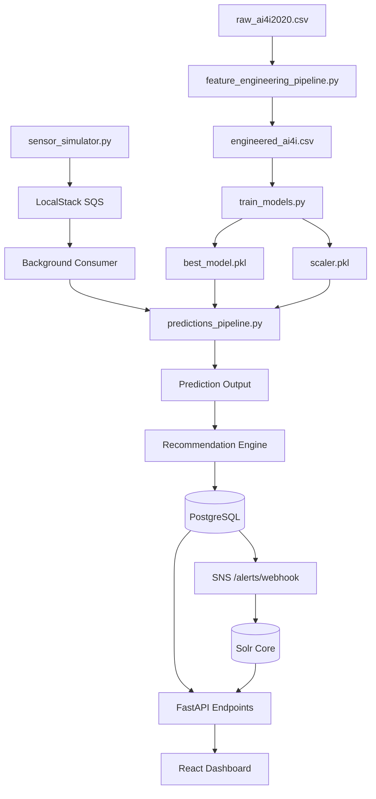
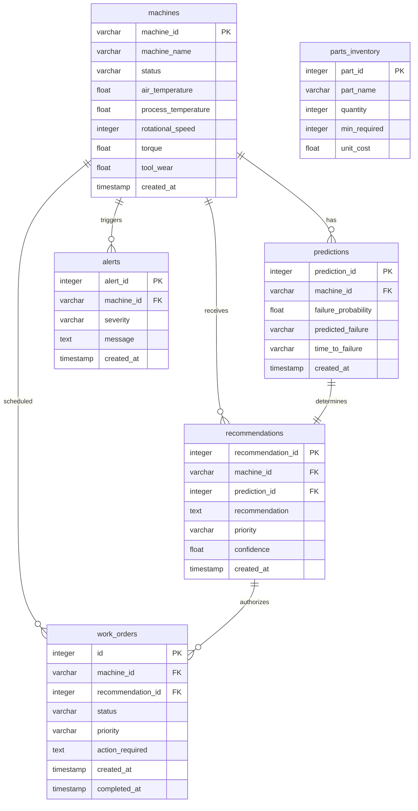

# FixForesight
## Industrial AI Predictive Maintenance Platform

FixForesight is an end-to-end industrial AI predictive and prescriptive maintenance platform. It is designed to ingest real-time sensor streams from factory machinery, perform machine learning inference to predict equipment failures before they happen, automatically prescribe inventory-vetted maintenance procedures, and log system incident archives.

---

## 1. Problem Statement & Solution

### The Problem
Traditional industrial manufacturing operations rely on inefficient maintenance strategies:
- **Reactive Maintenance (Run-to-Failure)**: Machinery is only serviced after breaking down. This results in catastrophic line shutdowns, long unexpected downtimes, expensive emergency shipping for spare parts, and massive recovery costs.
- **Preventive Maintenance (Calendar-Scheduled)**: Machinery is serviced at fixed time intervals regardless of actual wear. This leads to redundant labour overhead, replacing perfectly functional components early, and does not prevent sudden operational anomalies.
- **Disconnected Search Logs**: Historical logs are often trapped in unstructured text files, preventing engineers from searching for solutions to recurring errors.

### The Solution
FixForesight provides a modern, event-driven, predictive maintenance ecosystem:
1. **Continuous Telemetry Monitoring**: Scales and tracks live sensor thresholds.
2. **AI-Powered Ingestion & Inference**: Uses a Gradient Boosting Classifier to calculate exact failure probabilities and modes.
3. **Automated Maintenance Actions**: Recommends mitigation plans linked directly to real-time warehouse spare parts levels.
4. **Instant Semantic Search**: Indices incident records into an enterprise search index for sub-second query retrieval.

---

## 2. Technology Stack & Rationale

| Layer | Technology | Purpose / Where Used | Why Chosen |
| :--- | :--- | :--- | :--- |
| **Frontend UI** | React (v18.2) + CSS | Browser SPA Interface | Enables highly responsive dashboard views with real-time vital charts and sparklines. |
| **State Management** | Redux Toolkit | Frontend State Cache | Maintains predictable and synchronized states for fleet tables, alerts, and work orders. |
| **Backend API** | FastAPI + Uvicorn | Web API Services | Asynchronous, extremely fast REST server featuring automatic OpenAPI interactive docs. |
| **Database ORM** | SQLAlchemy | Python Object Model | Clean object-relational mapping, decoupling backend business logic from SQL dialects. |
| **Relational DB** | PostgreSQL 15 | Persistent Data Storage | Ensures ACID compliance, data integrity, and fast relational joins for audit records. |
| **DB Migrations** | Alembic | Schema Version Control | Handles structural database updates programmatically on startup without wiping records. |
| **Machine Learning** | scikit-learn | Model Training & Scaling | Industry standard library for tabular modeling, scaler tuning, and metrics evaluations. |
| **Model Storage** | joblib | Serialized Models Cache | High-speed binary serializer for reading/writing numpy-heavy classifiers and scalers. |
| **Cloud Simulation** | LocalStack (v3.8) | SQS & SNS Event Brokers | Mock AWS emulator enabling SQS buffer queues and SNS topic webhooks locally for free. |
| **Search Engine** | Apache Solr 9 | Logs Inverted Indexes | Core indexer allowing plant managers to execute instant text queries over incident logs. |
| **Containerisation** | Docker / Compose | Multi-container Orchestration | Packs the web app, database, search, and message brokers to run identically on any machine. |

---

## 3. High-Level System Architecture

```mermaid
graph TD
    subgraph Presentation ["Presentation Layer (React-Redux Frontend)"]
        UI["React SPA Dashboard (Port 3000)"]
        Store["Redux Toolkit Store"]
        UI <--> Store
    end

    subgraph Application ["Application Layer (FastAPI Backend)"]
        API["FastAPI App (Port 8000)"]
        Routes["API Routers (machines, predictions, alerts, etc.)"]
        SQSConsumer["Background SQS Telemetry Consumer"]
        DBService["DB Service Layer"]
        
        API --> Routes
        API --> SQSConsumer
        Routes --> DBService
        SQSConsumer --> DBService
    end

    subgraph ML ["Machine Learning Layer"]
        Model["GradientBoostingClassifier (best_model.pkl)"]
        Scaler["StandardScaler (scaler.pkl)"]
        Inference["Inference Pipeline"]
        
        DBService --> Inference
        Inference --> Scaler
        Scaler --> Model
    end

    subgraph Data ["Data & Messaging Layer"]
        Postgres[(PostgreSQL DB - Port 5432)]
        Solr[(Apache Solr Core - Port 8983)]
        SQS[[LocalStack SQS Queue]]
        SNS[[LocalStack SNS Topic]]
        
        DBService --> Postgres
        DBService --> Solr
        DBService --> SNS
        SQSConsumer --> SQS
    end

    subgraph Simulation ["Simulation Layer"]
        Simulator["Sensor Telemetry Simulator"]
        Simulator -- "Publishes telemetry JSON" --> SQS
    end

    %% Network Connections
    UI -- "REST API / Health Checks" --> API
    API -- "Webhook Callback (Port 8000)" <-- SNS
    SNS -- "Delivers Critical Alert Notification" --> API
    
    style Presentation fill:#112233,stroke:#334455,stroke-width:2px;
    style Application fill:#221133,stroke:#443355,stroke-width:2px;
    style ML fill:#113322,stroke:#335544,stroke-width:2px;
    style Data fill:#223311,stroke:#445533,stroke-width:2px;
```

---

## 4. End-to-End Data Pipeline



---

## 5. Database Schema (ER Diagram)



---

## 6. Repository Structure

```
FixForesight/
├── backend/                ← FastAPI application
│   ├── routes/             ← API endpoints (alerts, analytics, search, work orders)
│   ├── services/           ← Business logic & ML prediction triggers
│   ├── database/           ← Connection sessions & SQLAlchemy schema models
│   ├── schemas/            ← Pydantic contract validators
│   └── alembic/            ← DB programmatic migrations
├── frontend/               ← React Single Page Application (SPA)
│   ├── src/
│   │   ├── pages/          ← Dashboard, MachineDetails, Predictions, Alerts, Search, etc.
│   │   ├── store/          ← Redux Toolkit configuration & state slices
│   │   ├── services/       ← API service request configurations
│   │   ├── utils/          ← Metric helper functions and chart sparklines math
│   │   ├── index.css       ← Styling design tokens
│   │   └── index.jsx       ← React DOM renderer
│   └── Dockerfile          ← Frontend nginx deployment configuration
├── models/                 ← Serialized ML parameters (best_model.pkl, scaler.pkl)
├── src/                    ← Data engineering, simulators, and training pipelines
├── data/                   ← Dataset CSV source files
├── infra/                  ← LocalStack SQS/SNS initialization configurations
├── tests/                  ← Pytest automated suites (ML unit, API, integration tests)
├── docker-compose.yml      ← Port routing, volume mounts, and network binds
├── alembic.ini             ← Migration commands config file
└── requirements.txt        ← Global virtual environment package list
```

---

## 7. Project Documentation Index

| Documentation Reference | Content Description | Access Link |
| :--- | :--- | :--- |
| **FixForesight Master Document** | Complete Technical Architecture, Data Lifecycles, API references, Docker configs, Viva Prep Q&A, and Executable 15-Minute Live Demo Script. | **[Document.md](./Document.md)** |
| **Overview & Scope** | Objectives, boundaries, problem definition. | **[docs/01-project-overview/](./docs/01-project-overview/project-overview.md)** |
| **System Architecture** | Components layout, database relationships. | **[docs/02-architecture/](./docs/02-architecture/system-architecture.md)** |
| **Database Design** | PostgreSQL tables schema description. | **[docs/03-database/](./docs/03-database/database-design.md)** |
| **Machine Learning** | Model training configurations and model selections. | **[docs/05-machine-learning/](./docs/05-machine-learning/ml-overview.md)** |
| **Backend API Reference** | Routes specifications, queries, parameters. | **[docs/06-backend/](./docs/06-backend/api-reference.md)** |
| **Frontend Architecture** | Page structures, Redux store cache definitions. | **[docs/07-frontend/](./docs/07-frontend/frontend-architecture.md)** |
| **Infrastructure Setup** | LocalStack AWS emulation, Solr pre-creates. | **[docs/08-infrastructure/](./docs/08-infrastructure/docker.md)** |
| **Testing Strategy** | Pytest suites coverage and mock validations. | **[docs/09-testing/](./docs/09-testing/testing-strategy.md)** |
